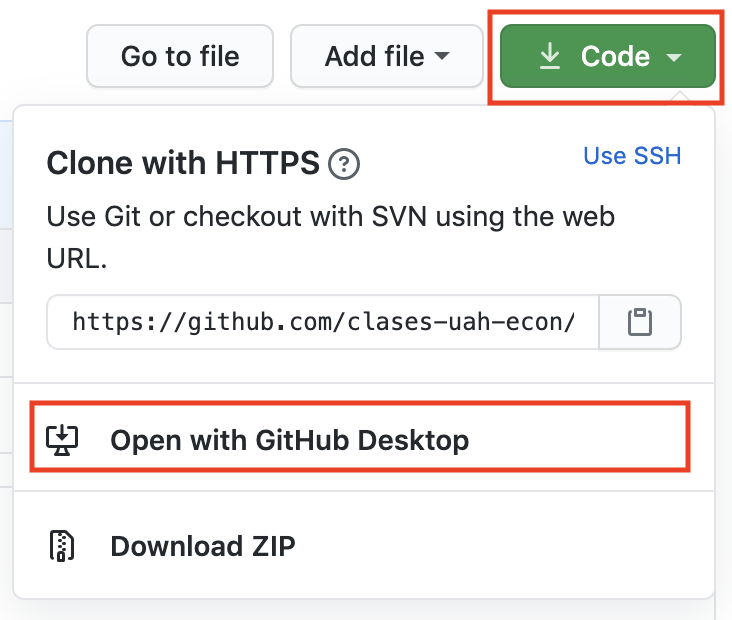
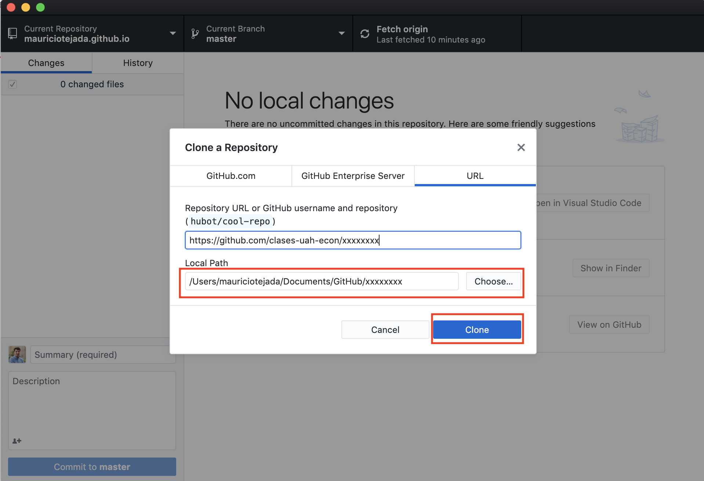
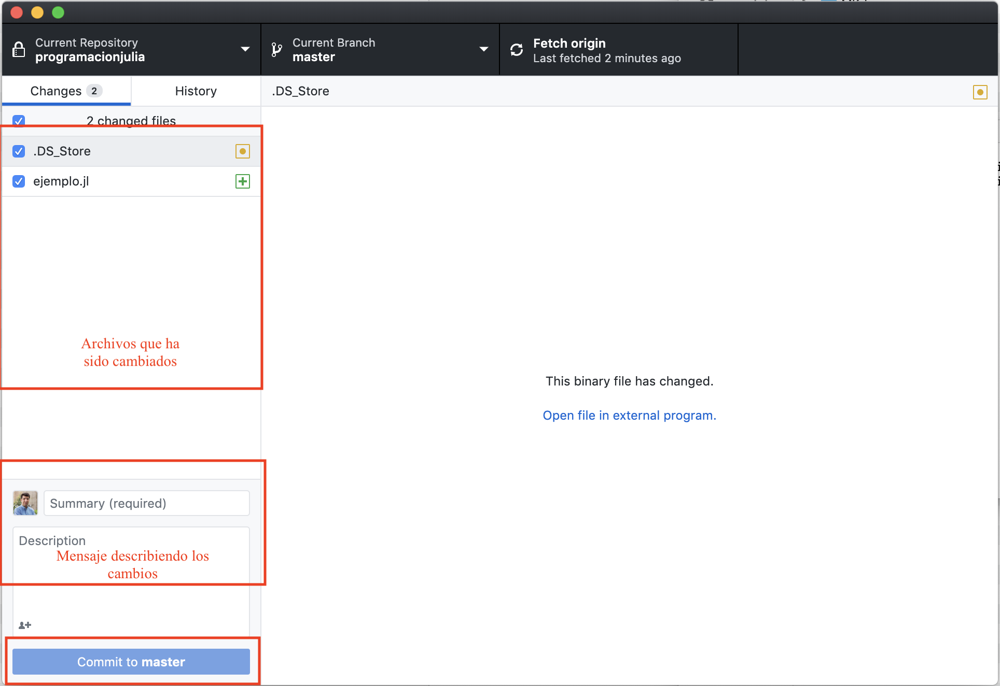
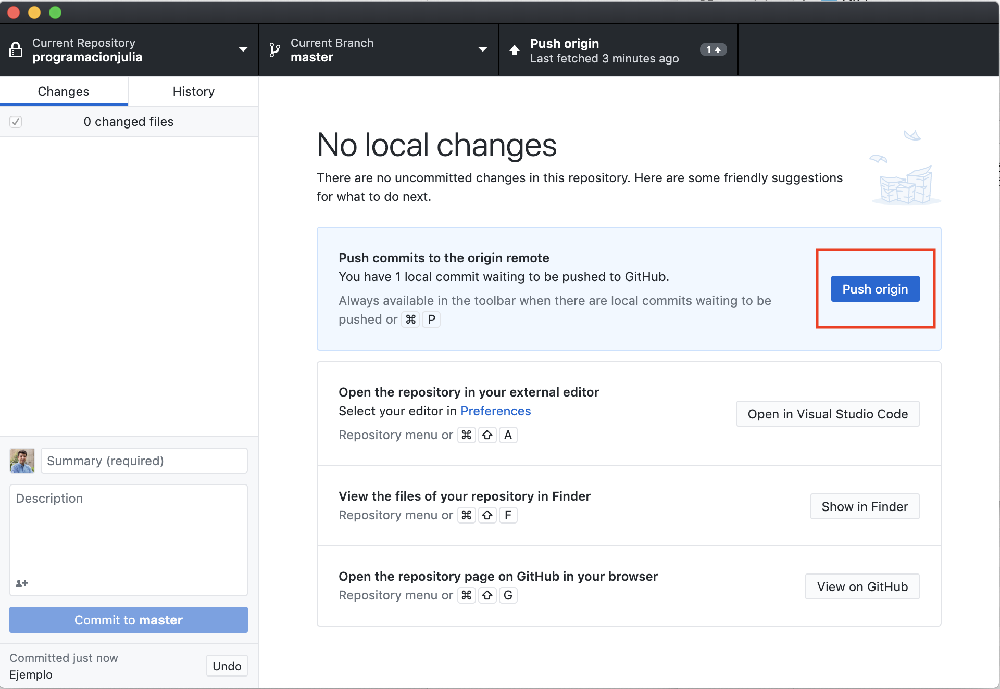

# Introducción a la Programación en Julia

## Descripción del Curso

Este material  corresponde al curso de Introducción a la Programación en Julia dicado en el Magister de Economía de la Universidad Alberto Hurtado (Santiago, Chile).

Las notas de clase para el curso se encuentran en el siguiente [link](https://mauriciotejada.com/programacionjulia/).

Adicionalmente, en la carpeta *src* de este repositorio encontrará todos los archivos `jl` y los `notebooks` asociados a la clase.

## Instalar Julia

Descargue *Julia* desde sitio oficial: 

https://julialang.org/downloads/

Elija la versión adecuada para su sistema operativo. La versión actual estable (a julio 2020) es 1.6.2. Instale el paquete descargado usando todas las opciones por defecto.

Para interactuar con *Julia* mientras escribimos los programas vamos a utilizar un editor de texto que sirva además como *Entorno Integrado de Desarrollo (IDE)*. Existe dos muy buenas opciones: *Visual Studio Code (VScode)* y *Atom*. Para el curso vamos a utilizar VScode.

Los editores de texto pueden descargarse desde sus respectivas páginas web. Abajo se presenta un breve descripción de cómo instalar la extensión que permite conectar el editor de texto con *julia*.

VScode: https://code.visualstudio.com/

- Abrir VScode y presionar command+shift+p (control+shift+p en windows) 
- Buscar: *Install Extensions*
- Buscar: *julia* e instalar.

## Flujo de Trabajo y Entrega de Tareas

Para que el flujo de trabajo sea fluido vamos a utilizar el paquete de control de versiones *Git* y su versión on-line *Github*. Para este curso vamos a aprender sólo lo básico. No obstante, una vez que aprendan a usar estas herramientas, les aseguro que les serán muy útiles en su trabajo programando en el futuro. 

Preliminares:

1. Cree una cuenta en *Github* usando su *email institucional*. Para ello vaya al link https://github.com/. Elija la opción cuenta gratuita.
2. Bajar *git* de https://git-scm.com/ (elegir la versión acorde a su sistema operativo) e instalar siguiendo todas las opciones por defecto.
3. Bajar *Github Desktop* de https://desktop.github.com/ (nuevamente, elegir la versión acorde a su sistema operativo) e instalar siguiendo todas las opciones por defecto. La primera vez que abra el programa, le pedirá los credenciales para acceder a su cuenta de *Github* creada en el paso 1.

La tarea será enviada vía email con un link a un repositorio que usted deberá aceptar. Puede pensar en un repositorio como la carpeta que contiene un proyecto. El formato del link es similar a:

https://classroom.github.com/Y/X-xxxxx

Una vez aceptado el repositorio, éste será direccionado a su cuenta de *Github* en su navegador de internet. Para enlazar el repositorio con su computadora, utilice el botón verde *code* arriba a la derecha y use la opción abrir el repositorio en *Github Desktop*:

En *Github Desktop* deberá definir el directorio en el cual se guardará el repositorio. Por defecto se creará una nueva carpeta con el nombre del repositorio (o proyecto). A continuación elija la opción clonar:

*Github Desktop* bajará todos los archivos del repositorio a su directorio local y creara el vínculo entre su computador y *Github*. Ahora puede trabajar normalmente en la carpeta creada modificando archivos, creando nuevos archivos o borrando innecesarios. Cuando requiera guardar la versión del proyecto actual abra *Github Desktop* y éste le mostrará todos los archivos que han cambiado (asegurese que está en el repositorio adecuado mirando la primera casilla arriba a la izquierda). En el ejemplo abajo tenemos el archivos `ejemplo.jl`. Abajo escriba un mensaje que le recuerde en que versión de su trabajo está, por ejemplo: *ejercicios 1 y 2 terminados*. A continuación presione el botón *commit*. Puede repetir este proceso cada vez que realice cambios en su carpeta.

Notará que *Github Desktop* le confirmará que no hay más cambios sin seguimiento en el equipo local. El siguiente paso es enviar su repositorio a *Github* para guardarlo en la nube y para que yo tenga acceso a su trabajo para su corrección. Siempre que realice un *commit*,  *Github Desktop* le desplegará el botón *push* con el que enviará el estado actual de su trabajo a *Github*.

Igual que antes, puede enviar su trabajo al repositorio de *Github* usando *push* tantas veces como sea necesario previo proceso de *commit*. Por supuesto debe respetar la fecha límite para entregar el trabajo. 
